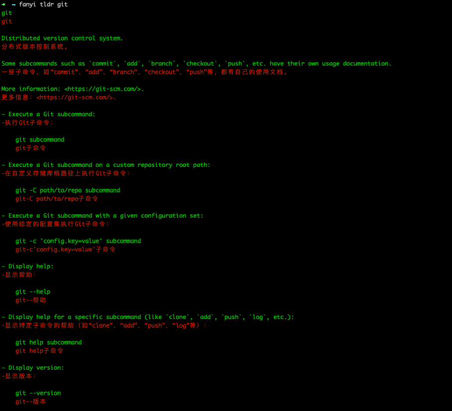

### <p align="center">command-fanyi</p>
#### <p align="center">命令行翻译工具,将命令行执行的结果翻译成中文</p>
#### <p align="center"><a href="https://github.com/jeffcail/command-fanyi/releases"></a><a href="https://github.com/jeffcail/command-fanyi/blob/master/LICENSE"></a><p>
#### <p align="center"><a href="./README.md" target="_blank">简体中文</a> | <a href="./README_en.md" target="_blank">English</a> </p>



## 翻译采用的百度翻译，你可以自行修改为其他翻译
> 设置百度翻译的appid 和 app secret
> 
> export APPID="**********"
> 
> export SECRETKEY="**********"

## 安装
```shell
curl -sSL https://raw.githubusercontent.com/jeffcail/command-fanyi/refs/heads/master/install.sh | bash
```

## 示例
```shell
fanyi go mod -h 
fanyi tldr git push
fanyi tldr curl
```
